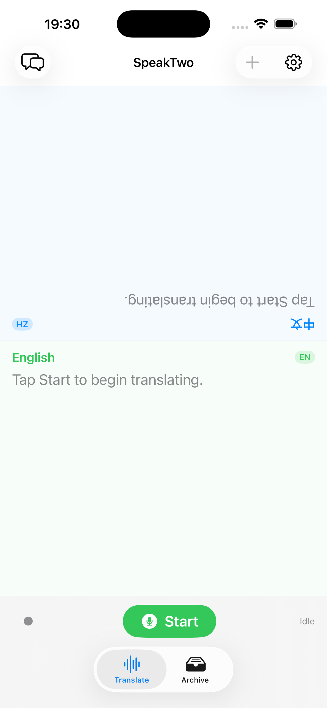
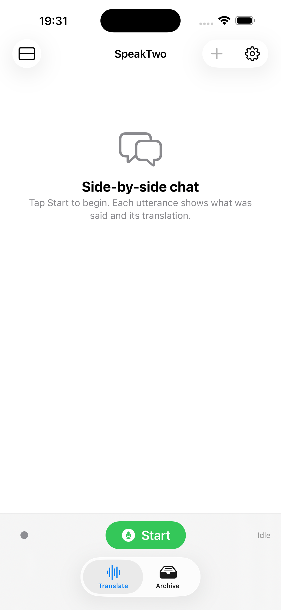
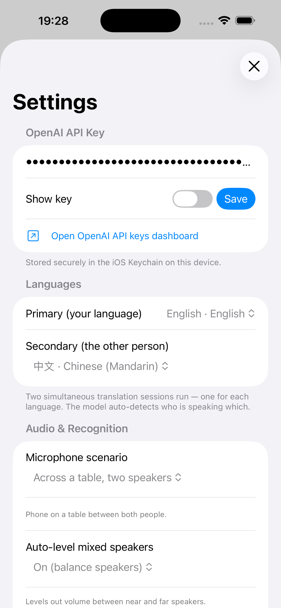

<div align="center">

# SpeakTwo

**Real-time, two-way speech translation for face-to-face conversations.**

Put your phone on the table between two people and let them talk in their own
languages — SpeakTwo transcribes and translates both sides live, powered by
OpenAI's `gpt-realtime-translate`.

[](https://www.apple.com/ios/)
[](https://swift.org)
[](https://developer.apple.com/xcode/swiftui/)
[](LICENSE)

**[🌐 Visit the website →](https://everettjf.github.io/SpeakTwo/)**

</div>

<div align="center">
  
  &nbsp;
  
  &nbsp;
  
</div>

---

## What it is

SpeakTwo is a [BYOK](#byok--cost) (Bring Your Own Key) iOS app for live,
in-person interpreting. Two people pick their languages once, hit **Start**, and
talk naturally. The app auto-detects who's speaking which language and streams
the translation as they go — no turn-taking, no buttons to pass back and forth.

It runs **two simultaneous realtime sessions** (one per direction) over WebSocket
straight to OpenAI. Your API key lives in the device Keychain; there is no
developer-operated server in the loop.

## Features

- 🎙️ **Live two-way translation** — both directions stream at once; the model
  auto-detects the source language from the audio.
- 🔄 **Two display modes**
  - **Face-to-face** — two panels, the top one rotated 180° for the person
    sitting across from you.
  - **Side-by-side chat** — a single chronological transcript showing each
    utterance and its translation.
- 🎚️ **Audio tuning for the room** — microphone-scenario presets (phone held
  close vs. on a table between two people) and optional auto-leveling to balance
  near and far speakers.
- 🗂️ **Local archive** — past sessions are saved on-device so you can review
  transcripts later.
- 🔐 **Privacy by design** — API key in the Keychain, audio sent directly to
  OpenAI, nothing routed through a third-party backend. See [PRIVACY.md](PRIVACY.md).
- 🩺 **Built-in diagnostics** — a live log of the realtime connection for
  debugging.

## Supported languages

Translation output supports the 13 languages offered by `gpt-realtime-translate`:

| | | | |
|---|---|---|---|
| English | 中文 (Mandarin) | Español | Português |
| Français | Deutsch | Italiano | 日本語 |
| 한국어 | Русский | हिन्दी | Bahasa Indonesia |
| Tiếng Việt | | | |

## Requirements

- iOS 26.0 or later
- Xcode 26+
- An [OpenAI API key](https://platform.openai.com/api-keys) with access to
  `gpt-realtime-translate`

## Getting started

```bash
git clone https://github.com/everettjf/SpeakTwo.git
cd SpeakTwo
open SpeakTwo.xcodeproj
```

Then in Xcode:

1. Select your team under **Signing & Capabilities** (the bundle identifier is
   `com.xnu.speaktwo` — change it to your own).
2. Build and run on a **physical device** — the iOS Simulator cannot capture
   microphone audio.
3. On first launch, open **Settings** and paste your OpenAI API key (stored in
   the Keychain), then pick the two languages.
4. Tap **Start** and talk.

## BYOK & cost

SpeakTwo has no subscription and no backend. You bring your own OpenAI API key
and pay OpenAI directly for realtime audio usage. Because translation runs as
two concurrent realtime sessions, expect roughly double the per-minute audio
cost of a single session. The app tracks usage locally so you can keep an eye on it.

## Architecture

A small, dependency-free SwiftUI app:

```
SpeakTwo/
├── Models/        Language, AppSettings, ChatSession, KeychainStore, TranslationError
├── Views/         Home, Chat, Transcript, Settings, Archive, Onboarding, Diagnostics
└── Services/
    ├── RealtimeTranslator      One WebSocket session → one target language
    ├── TranslationCoordinator  Orchestrates both directions + state
    ├── AudioCaptureService     Microphone capture & framing
    ├── SessionStore            Local persistence of transcripts
    ├── UsageTracker            Local usage accounting
    └── DiagnosticsLogger       Connection log for debugging
```

Each `RealtimeTranslator` owns a single connection to `gpt-realtime-translate`
configured for one output language; the `TranslationCoordinator` runs two of
them and merges their transcript deltas into the UI. Transient socket failures
are auto-reconnected with exponential backoff.

## Testing

Unit tests cover error classification and reconnect backoff:

```bash
xcodebuild test \
  -project SpeakTwo.xcodeproj \
  -scheme SpeakTwo \
  -destination 'platform=iOS Simulator,name=iPhone 16'
```

## Deployment

`deploy.sh` bumps the build number, archives, and uploads to TestFlight:

```bash
export APPLE_ID="you@example.com"
export APP_SPECIFIC_PASSWORD="xxxx-xxxx-xxxx-xxxx"   # appleid.apple.com → App-Specific Passwords
./deploy.sh
```

## Privacy

SpeakTwo collects no personal data through any developer-operated server. Your
API key stays in the Keychain, audio goes directly to OpenAI, and transcripts
are saved only on your device. Full policy: [PRIVACY.md](PRIVACY.md).

## Contributing

Issues and pull requests are welcome. For bugs or feature ideas, please
[open an issue](https://github.com/everettjf/SpeakTwo/issues).

## License

Released under the [MIT License](LICENSE).
